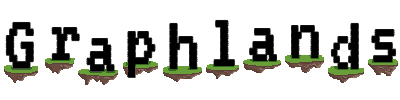

[![Contributors][contributors-shield]][contributors-url]
[![Forks][forks-shield]][forks-url]
[![Stargazers][stars-shield]][stars-url]
[![Issues][issues-shield]][issues-url]

<!-- PROJECT LOGO -->
 

  

<h3 align="center">Graphlands (Project Name: Dollar Gamr)</h3>

  

    An awesome Puzzle Game that will train your braincells.
     
    <a href="https://graphlands.herokuapp.com/"><strong>Try it out »</strong></a>
     
     
    <a href="https://github.com/IMI-DollarGame/Graphlands/issues">Report Bug</a>
    ·
    <a href="https://github.com/IMI-DollarGame/Graphlands/issues">Request Feature</a>
  

<!-- TABLE OF CONTENTS -->

  
Table of Contents

  <ol>
    <li>
      <a href="#about-the-project">About The Project</a>
      <ul>
        <li><a href="#built-with">Built With</a></li>
      </ul>
    </li>
    <li><a href="#usage">Usage</a></li>
    <li><a href="#contributing">Contributing</a></li>
    <li><a href="#credits">Credits</a></li>
    <li><a href="#acknowledgements">Acknowledgements</a></li>
  </ol>

<!-- ABOUT THE PROJECT -->
## About The Project

[![Product Name Screen Shot][product-screenshot]](https://example.com)

Based on the “Dollar Game”, we created Graphlands, an enveloping, approachable riddle game for young and old.
In over 30 levels, you will populate islands, try to spread your population as equally as possible and crack your high score, while subconsciously training your brain and learning about graph theory. To ensure its accessibility, our game is playable on your computer or tablet in your personal browser of choice. And with an endearing yet simple design, even kids get a chance to play.
### Built With

* [Phaser](https://phaser.io)
* [Webpack](https://webpack.js.org)
* [Heroku](https://www.heroku.com)

<!-- USAGE EXAMPLES -->
## Usage

In order to start the project you need to run the followong commands in terminal :
- npm install
- npm run dev  // or npm run build (in order to build)

Note:
Inside of the src folder we have scenes folder : there you find all Scenes , which we need for the project : e.g. Tutorail scene, Levels scene , etc.

<!-- CONTRIBUTING -->
## Contributing

Contributions are what make the open source community such an amazing place to be learn, inspire, and create. Any contributions you make are **greatly appreciated**.

1. Fork the Project
2. Create your Feature Branch (`git checkout -b feature/AmazingFeature`)
3. Commit your Changes (`git commit -m 'Add some AmazingFeature'`)
4. Push to the Branch (`git push origin feature/AmazingFeature`)
5. Open a Pull Request

<!-- CREDITS -->
## Credits

During the development of the game, several free images,music and assets were downloaded from various sources.
All images, music and assets can be used for free and without any restrictions.  

Music/Sound effects:  
https://www.scottbuckley.com.au/library/wanderlust/  
https://www.youtube.com/watch?v=s3fEbZwiJ94  
https://www.fesliyanstudios.com/play-mp3/2903  
https://mixkit.co/free-sound-effects/  
 
Buttons/Icons:  
https://en.wikipedia.org/wiki/File:Octicons-mark-github.svg  
https://de.wikipedia.org/wiki/Facebook  
https://de.wikipedia.org/wiki/Twitter  
https://fonts.google.com/icons  
 
Background Images:  
https://pixabay.com/de/photos/himmel-wolken-d%c3%bcster-dramatisch-592415/  
https://pixabay.com/de/photos/wolke-dunkel-sturm-hintergrund-2725520/  
https://pixabay.com/de/photos/wolken-natur-himmel-cumulus-4215608/  
https://pixabay.com/de/photos/wolken-himmel-hell-tageslicht-1282314/  
https://pixabay.com/de/photos/wolken-himmel-2483302/  
https://unsplash.com/photos/AnGx1n-gtw8  
 
Fonts & Animation:  
https://www.freepik.com/free-photos-vectors/background%22%3EBackground  
https://fonts.google.com/specimen/Montserrat?selection.family=Montserrat  
https://www.dafont.com/de/neon-80s.font  

<!-- ACKNOWLEDGEMENTS -->
## Acknowledgements
* Felix Deumlich
* Laura Unverzagt
* Linh Pham
* Marie-Christin Grundmann
* Markus Merker
* Mukhammad Safarov
* Nadya Kandakova
  

<!-- MARKDOWN LINKS & IMAGES -->
<!-- https://www.markdownguide.org/basic-syntax/#reference-style-links -->
[contributors-shield]: https://img.shields.io/github/contributors/IMI-DollarGame/Graphlands.svg?style=for-the-badge
[contributors-url]: https://github.com/IMI-DollarGame/Graphlands/graphs/contributors
[forks-shield]: https://img.shields.io/github/forks/IMI-DollarGame/Graphlands.svg?style=for-the-badge
[forks-url]: https://github.com/IMI-DollarGame/Graphlands/network/members
[stars-shield]: https://img.shields.io/github/stars/IMI-DollarGame/Graphlands.svg?style=for-the-badge
[stars-url]: https://github.com/IMI-DollarGame/Graphlands/stargazers
[issues-shield]: https://img.shields.io/github/issues/IMI-DollarGame/Graphlands.svg?style=for-the-badge
[issues-url]: https://github.com/IMI-DollarGame/Graphlands/issues
[product-screenshot]: assets/Screenshot.png
